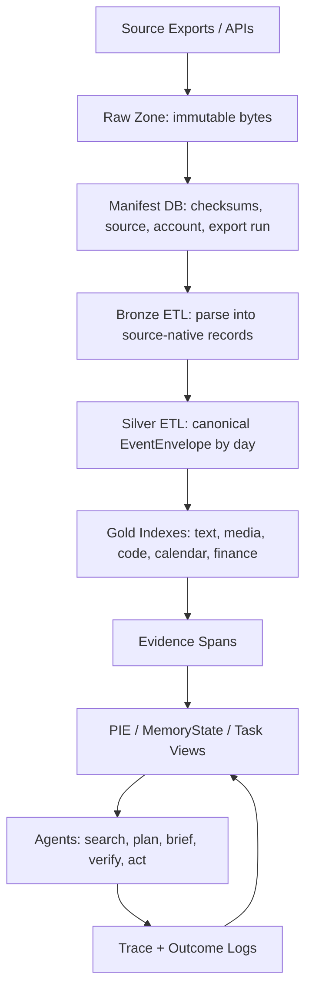

# AI Lakehouse / Universal Ingestion Engine HLD

Status: design proposal  
Date: 2026-06-11  
Goal: ingest all personal/work data sources into a durable, auditable substrate that can feed PIE/world-model extraction, retrieval, learning, verification, and autonomous agents.

## 1. Thesis

The product is not "better RAG over exports." It is a local-first AI lakehouse:

```text
raw exports -> deterministic daily ETL -> canonical event/artifact store
            -> evidence spans -> learned/verified memory states
            -> task agents, briefings, research, planning, automation
```

The invariant is: never let an LLM be the source of truth. The LLM can write interpretations, summaries, entities, hypotheses, and tasks, but every derived object must point back to immutable raw artifacts and spans.

This directly extends the current `mempol/core` primitives:

- `Artifact`: immutable source object.
- `Span`: addressable evidence slice.
- `MemoryState`: learned/compressed state with provenance.
- `TraceEvent`: logged read/write/tool/consolidation decision.

The missing layer is the lakehouse below those primitives: raw export storage, deterministic source adapters, daily partitions, manifests, checksums, schema versions, and replayable ETL.

## 2. Design Principles

1. Raw data is append-only and content-addressed.
2. Every connector has two modes: `snapshot_export` and `incremental_sync` when the source supports it.
3. Deterministic ETL runs before LLM extraction. Fast parsing, timestamp normalization, dedupe, attachment handling, and daily partitioning must not depend on model calls.
4. The canonical unit is not "chat" or "email"; it is an `EventEnvelope` pointing to one or more artifacts/spans.
5. PIE becomes one semantic view over the lakehouse, not the core store.
6. All AI writes are reproducible: prompt/model/input spans/output/score are logged as `TraceEvent`.
7. Delete/archive policies operate on derived views first; raw source retention is user-controlled separately.

## 3. Architecture



### Storage Layers

`raw/`

- Original zip, mbox, json, markdown, sqlite copy, image, PDF, repo snapshot, API page response.
- Path pattern: `data/raw/source=<source>/account=<account>/export_run=<run_id>/...`
- Record SHA-256, byte size, created/imported timestamps, source URI, and permissions.

`bronze/`

- Source-native parsed records. Still close to original format.
- Examples: Gmail message JSON from MBOX, Drive file metadata, ChatGPT conversation tree, OneTab URL groups.

`silver/`

- Canonical daily partitioned records.
- Path pattern: `data/silver/date=YYYY-MM-DD/source=<source>/part-*.jsonl`
- Each row is an `EventEnvelope`.

`gold/`

- Query-optimized projections: SQLite/DuckDB tables, FTS, vector index, image OCR index, code symbol index, calendar timeline.

`semantic/`

- PIE world models, MemoryStates, daily digests, project state, task state, contradiction maps, learned consolidation outputs.

## 4. Canonical Event Envelope

This is the stable schema every source becomes before any LLM touches it:

```json
{
  "event_id": "sha256(source|source_native_id|occurred_at|content_hash)",
  "source": "gmail|kortex|onetab|gdocs|gphotos|notebook|repo|apple_notes|calendar|tasks|chatgpt|claude|grok|kosmos|github|vercel|finance|...",
  "account": "personal|school|work|unknown",
  "kind": "message|document|note|photo|calendar_event|task|code_file|commit|browser_tab|chat_turn|transaction|canvas_object|...",
  "occurred_at": "2026-06-11T14:03:00-04:00",
  "ingested_at": "2026-06-11T22:10:00-04:00",
  "valid_time": {
    "start": "optional",
    "end": "optional",
    "confidence": "explicit|inferred|unknown"
  },
  "actors": [
    {"role": "author|sender|recipient|attendee|owner", "id": "opaque", "display": "string"}
  ],
  "title": "human readable title",
  "body_text": "normalized searchable text",
  "artifact_ids": ["raw_artifact_id"],
  "span_ids": ["span_id"],
  "attachments": [
    {"artifact_id": "id", "mime": "image/jpeg|application/pdf|...", "role": "attachment|inline|thumbnail"}
  ],
  "thread": {
    "thread_id": "source-specific thread/project/conversation id",
    "parent_id": "optional",
    "position": 0
  },
  "project_hints": ["repo name, folder, label, calendar, email label"],
  "privacy": {
    "sensitivity": "normal|private|financial|health|credential|third_party",
    "sharing": "self|team|public|unknown"
  },
  "source_metadata": {}
}
```

Keep the core schema generic. Domain-specific objects are views generated from this envelope, not required columns.

## 5. Source Plan

| Source | Raw export first | Deterministic ETL | Incremental path | Notes |
|---|---|---|---|---|
| Gmail | Google Takeout MBOX, plus labels metadata where available. Google documents Takeout as the bulk account export path. | Parse MBOX to messages, headers, body parts, attachments, labels, threads; partition by message date. | Gmail API `users.messages.list` and `messages.get`; `list` supports Gmail search query syntax. | Use API for deltas; Takeout for backfill. |
| Kortex | Workspace/files markdown export. Kortex says workspaces/files can export as Markdown. | Parse Markdown, frontmatter, links, tags, embedded assets; preserve original path. | Watch export folder or app data if accessible. | Treat as notes/documents, not memory yet. |
| Browser / OneTab | OneTab export/import URL text. OneTab states it can export/import tab lists as URLs. Browser history via Chrome/Arc SQLite copy later. | Parse URL/title/group/order/time if available; fetch page metadata separately. | Browser history DB snapshot, bookmark APIs, or extension export. | Tabs are intent signals; don't over-summarize. |
| Google Docs / Drive | Google Takeout Drive export or Drive API. | Export Google Docs to Markdown/HTML/PDF/text where possible; store metadata, revisions if available. | Drive API `files.list`, `files.export`; export has 10 MB limit per exported Workspace doc. | Large docs may need chunked Docs API or Takeout fallback. |
| Google Photos | Google Takeout for full media backfill. | Store media bytes, EXIF, JSON sidecars, albums, OCR/captions later. | Photos Library API is limited; current docs emphasize app-created media item operations, so don't rely on it for complete historical export. | Raw photos are heavy; start metadata + thumbnails + selected OCR. |
| Physical notebooks | Scan/photo pages. | Page image artifact, OCR text, page/date/source notebook id, optional handwriting confidence. | Manual scan batch. | Never discard page images; OCR is derived. |
| Local coding projects | Git repo snapshot + commit history. | File artifacts, symbols, imports, tests, commits, issues if linked. | Git filesystem watcher + GitHub API. | Store code as artifacts; code intelligence view separate. |
| Apple Notes | Apple Notes supports per-note PDF and Markdown export in the Mac app. | Prefer Markdown export if available; otherwise PDF/HTML/SQLite-derived export. | Periodic export or local SQLite copy with caution. | Bulk export is awkward; use first-party Markdown where possible. |
| Google Calendar | Google Calendar supports `.ics` export and Calendar API. | Events, attendees, recurrence expansion, attachments, locations, meeting notes links. | Calendar API events.list / sync tokens. | Calendar is the backbone for time partitioning. |
| Google Tasks | API. | Task lists, tasks, due/completed times, notes, links to Docs/Gmail. | Google Tasks API tasklists/tasks. | Tasks are candidate autonomous-resume hooks. |
| ChatGPT | Official ChatGPT data export ZIP. | Parse `conversations.json`, flatten tree to turns, files/images/artifacts. | Manual periodic export; no stable public full-history API. | Existing repo has ChatGPT export parsing pieces. |
| Claude | Official Claude export from Settings → Privacy → Export data. | Conversations, projects, artifacts if present, timestamps, account. | Manual periodic export unless API/source changes. | Separate personal vs shared-with-brother account/account_identity. |
| Grok | Unknown/fragile. | Prefer official X/Grok export if available; otherwise browser automation/manual conversation export. | TBD. | Mark low reliability. |
| Kosmos AI Scientist / school email | Export local run logs, repo, papers, reports; Gmail/Drive for school account. | Experiments, paper claims, code outputs, reports, citations. | Git/file watcher + Gmail/Drive school sync. | High value for research-agent memory. |
| Canva / Miro / Canvas | Manual exports + APIs where worth it. | PDFs/images/boards/course artifacts, comments, assignments. | Later. | Don't block v1 on these. |
| Vercel / GitHub / Supabase / Smithery | API/CLI exports. | Deployments, PRs, commits, issues, env var names only, DB schema snapshots, tool inventory. | APIs/webhooks. | Critical for project/dev world model. |
| Rocket Money / finances | CSV export/manual. | Transactions, merchants, subscriptions, budgets. | Later/manual. | Sensitive; derived views should redact by default. |

## 6. PIE Re-Ingestion Strategy

PIE should ingest from `silver` day partitions, not raw source files directly.

Pipeline:

```text
source export -> raw artifact -> deterministic parser -> EventEnvelope
              -> day bundle -> PIE extraction job
              -> world_model view + MemoryState view + trace logs
```

PIE job input should be a coherent daily or session bundle:

- Emails in a thread.
- Chat turns in a conversation segment.
- Calendar event plus surrounding emails/docs/tasks.
- Repo commit plus files/issues/PR discussion.
- Notes created/edited that day.

This fixes the old mistake of processing tiny datums without enough surrounding state. The unit for extraction should be adaptive but deterministic before learning:

- Default: daily bundle.
- For chat: conversation session or 50-turn window with overlap.
- For email: thread.
- For docs/notes: document section.
- For repos: commit/PR/change set.
- For calendar: event plus linked artifacts.

The LLM writer sees:

1. Current retrieved world model.
2. The new day/session bundle.
3. Source spans.
4. Existing unresolved tasks/projects.
5. Permission/sensitivity flags.

It writes derived states, never raw facts without provenance.

## 7. Learning / Verification Layer

Do not train first. Log first.

Phase A: deterministic lakehouse

- Backfill exports.
- Build manifests/checksums.
- Parse to `EventEnvelope`.
- Partition by day/source.
- Build dashboard.

Phase B: semantic writer

- PIE/MemoryState writer processes daily bundles.
- Writes claims, project state, personal state, tasks, relationships, time-valid states.
- Logs every proposed write, accepted write, rejected write, source spans, and validation result.

Phase C: verifier

- Deterministic validators: missing provenance, impossible timestamps, duplicate artifacts, invalid URLs, broken source spans.
- LLM validators: contradiction checks, entity resolution checks, temporal validity checks.
- Human review queue for sensitive/high-impact memories.

Phase D: autonomous tasks

- Daily briefing.
- Stale project detector.
- "Resume this thread" planner.
- Calendar/task/email follow-up agent.
- Research/project agent that reads code/docs/logs and proposes next actions.

Phase E: learning

- Train write/retrieve/consolidate policies from trace logs.
- Reward = downstream task success - retrieval/write/verification cost - unsupported claim penalty.
- Use real future tasks as labels when possible: later user queries, completed tasks, opened projects, accepted plans.

## 8. Core Tables

Minimal local implementation can use SQLite/DuckDB first:

```text
raw_artifacts(
  artifact_id, source, account, uri, raw_path, sha256, mime, bytes,
  source_created_at, imported_at, metadata_json
)

events(
  event_id, source, account, kind, occurred_at, date_partition,
  title, body_text, thread_id, parent_id, source_native_id,
  artifact_ids_json, actor_json, privacy_json, source_metadata_json
)

spans(
  span_id, event_id, artifact_id, locator, start, end, text, metadata_json
)

memory_states(
  state_id, content, source_span_ids_json, created_at, updated_at,
  valid_from, valid_until, archived, utility_json, metadata_json
)

trace_events(
  trace_id, run_id, op, input_json, output_json, metrics_json, created_at
)

sync_state(
  source, account, cursor, last_success_at, last_error, config_hash
)
```

If this grows, graduate storage:

- Raw bytes: local filesystem / S3-compatible object store.
- Tables: DuckDB locally, Iceberg/Delta later.
- Search: SQLite FTS first, Tantivy/Meilisearch later.
- Vector: sqlite-vec/FAISS locally, pgvector/Qdrant later.
- Graph view: Graphiti/Zep-style bitemporal graph or Neo4j later, but not the core source of truth.

## 9. First Build Slice

Build the system in this order:

1. `lakehouse/` package with `RawArtifact`, `EventEnvelope`, `SourceConnector`, `ManifestStore`.
2. Raw import commands:
   - `ingest_raw --source gmail_takeout --path ...`
   - `ingest_raw --source chatgpt_export --path ...`
   - `ingest_raw --source kortex_markdown --path ...`
   - `ingest_raw --source local_repo --path ...`
3. Deterministic ETL to `data/silver/date=.../source=.../*.jsonl`.
4. Dashboard: source counts, date heatmap, parse errors, dedupe stats, raw-to-silver lineage.
5. PIE daily-bundle re-ingestion from silver.
6. Query demo: "What projects am I actively pushing, what changed this week, and what should I do next?"

## 10. Risks

- Privacy: this merges extremely sensitive data. Default to local-only, no cloud upload, redaction in dashboards.
- Identity resolution: same person across Gmail/Calendar/Claude/GitHub can be wrong. Keep actor IDs source-scoped until verified.
- Timestamp lies: source created time, event referenced time, and ingestion time are different. Store all three.
- API incompleteness: Takeout/manual exports are required for full backfills; APIs are for deltas.
- LLM overreach: derived memories must remain auditable and reversible.
- Data volume: photos/videos/repos can dominate storage. Start with metadata/thumbnails/OCR and keep raw media optional.

## 11. External Interface References

- Google Takeout account export: https://support.google.com/accounts/answer/3024190
- Gmail API messages list/get: https://developers.google.com/workspace/gmail/api/guides/list-messages
- Google Drive export: https://developers.google.com/workspace/drive/api/guides/manage-downloads
- Google Calendar export/API: https://support.google.com/calendar/answer/37111 and https://developers.google.com/workspace/calendar/api/guides/overview
- Google Tasks API: https://developers.google.com/workspace/tasks/reference/rest
- Google Photos Library API: https://developers.google.com/photos/library/reference/rest
- Apple Notes export: https://support.apple.com/guide/notes/import-export-and-print-notes-not201900c07/mac
- OneTab export/import URLs: https://www.one-tab.com/
- ChatGPT export: https://help.openai.com/en/articles/7260999-how-do-i-export-my-chatgpt-history-and-data
- Claude export: https://support.claude.com/en/articles/9450526-how-can-i-export-my-claude-data
- Kortex markdown export: https://www.kortex.co/
