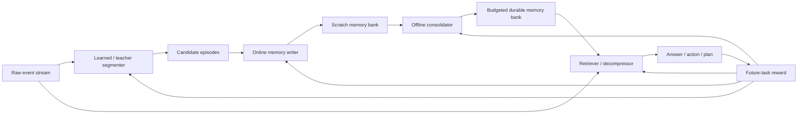

# Mempol v2 Build Spec: A Budgeted Memory Compiler For Long-Horizon Agents

Status: design for approval.

Last updated: 2026-05-23.

## 1. One-Sentence Thesis

Mempol should become a learned memory compiler: it turns an unbounded stream of conversations, documents, tool results, and agent activity into a compact memory bank that maximizes future task success under strict storage, retrieval, latency, and dollar budgets.

This is deliberately not "a better KG." The KG/write-tool code in the repo is useful scaffolding and a baseline, but the research bet is learned segmentation, learned consolidation, and learned retrieval/decompression.

## 2. What Problem Are We Uniquely Solving?

Current agent memory systems mostly choose one of three weak positions:

1. Store raw chunks and retrieve them with RAG.
2. Extract facts into a fixed memory schema.
3. Build temporal/graph structure with mostly prompt-engineered updates.

Those are useful but not enough. They do not directly solve the central problem:

```text
Given an unbounded event stream and unknown future tasks,
which compressed memory state should we maintain so the agent gets
future answers/actions right with minimal context?
```

The unique problem is budgeted future-utility memory construction.

The scientific question:

```text
Can a learned memory compiler beat raw-RAG, prompted extraction, and temporal KG baselines on the Pareto frontier of:

  future task accuracy
  vs durable memory tokens
  vs retrieved context tokens
  vs write/read cost
```

The product question:

```text
Can we give agents a durable, inspectable, compact memory bank that lets them resume projects, track changing user/world state, and act proactively without stuffing whole histories into context?
```

## 3. What We Are Not Building

We are not building a hand-written ontology with a final list of kinds like:

```text
entity | event | goal | decision | belief | procedure | relationship
```

That can remain a debug view, a baseline, or an optional projection. It should not be the core representation. The real system should learn useful boundaries and abstractions from data.

We are not treating per-write counterfactual evaluation as the scalable training loop. It is too expensive. It remains a gold diagnostic and reward-model training source.

We are not claiming timestamps alone are novel. Temporal awareness matters only when memory captures validity, state transitions, elapsed time, stale/current distinctions, and project trajectories.

## 4. Core System Picture



The system has two loops:

1. Online loop: ingest new events quickly, preserve provenance, make safe approximate writes.
2. Offline loop: consolidate regions after the fact, compress repeated patterns, repair contradictions, and optimize for measured future utility.

The offline loop is where the research lives.

## 5. First-Principles Objective

Let:

```text
X_1:t = raw history through time t
M_t   = durable memory bank after processing X_1:t
Q>t   = future queries/tasks/actions after time t
R     = reader/agent that uses M_t and optionally raw evidence
```

We want:

```text
maximize   E[score(R(Q>t, M_t, raw_log))]
minimize   tokens(M_t) + retrieved_tokens + write_calls + read_calls + latency + stale_error
```

This makes the core benchmark a Pareto frontier, not a single accuracy number.

Primary metrics:

- `answer_score`: LLM-judge or exact score for future QA/task.
- `evidence_recall`: whether retrieved memory/raw spans include necessary evidence.
- `memory_tokens`: durable memory size.
- `retrieval_tokens`: tokens inserted into answer context.
- `compression_ratio`: raw tokens divided by durable memory tokens.
- `retrieval_precision`: fraction of retrieved tokens judged useful.
- `staleness_error`: answer used expired state as current state.
- `trajectory_error`: answer missed before/after/change-over-time relation.
- `write_cost`: model calls and tokens spent at ingestion.
- `read_cost`: model calls and tokens spent at query time.

Secondary metrics:

- `update_merge_rate`: how often the system updates/merges instead of creating duplicates.
- `provenance_coverage`: fraction of memory claims linked to raw evidence.
- `budget_robustness`: performance at 256, 512, 1k, 2k, 4k memory-token budgets.
- `latency_p50/p95`: important for product viability.

## 6. Representation

### 6.1 Raw Log

Raw logs are immutable. This is non-negotiable because every compressed memory can be wrong.

```json
{
  "source_id": "locomo:conv-26:D2:9",
  "stream_id": "conv-26",
  "observed_at": "2023-05-25T13:14:00Z",
  "speaker": "Caroline",
  "text": "Researching adoption agencies...",
  "metadata": {
    "dataset": "locomo",
    "session": "D2",
    "dia_id": "D2:9"
  }
}
```

### 6.2 Episode

An episode is a learned or teacher-labeled span, not a fixed token chunk.

```json
{
  "episode_id": "ep_001",
  "stream_id": "conv-26",
  "source_ids": ["locomo:conv-26:D2:7", "locomo:conv-26:D2:8", "locomo:conv-26:D2:9"],
  "time_start": "2023-05-25T13:14:00Z",
  "time_end": "2023-05-25T13:14:00Z",
  "boundary_reason": "Topic shifts from Melanie self-care to Caroline adoption planning.",
  "summary": "Caroline is actively researching adoption agencies and wants to adopt as a single parent."
}
```

Boundary labels are trainable. Initial labels can come from a frontier LLM teacher; later we can train a smaller boundary model.

### 6.3 Memory Cell

This is the durable learned memory object. It avoids a fixed ontology while preserving production invariants.

```json
{
  "memory_id": "mem_abc123",
  "content": "Caroline is actively researching LGBTQ-inclusive adoption agencies because she wants to adopt as a single parent and provide children a loving home.",
  "compressed_from": ["ep_001", "ep_004", "ep_009"],
  "evidence_source_ids": ["locomo:conv-26:D2:9", "locomo:conv-26:D2:11"],
  "time": {
    "observed_at": "2023-05-25T13:14:00Z",
    "valid_from": "2023-05-25T13:14:00Z",
    "valid_until": null,
    "status": "current_or_unknown"
  },
  "routing_hints": {
    "natural_language_tags": ["Caroline", "adoption", "LGBTQ-inclusive agency", "family goal"],
    "likely_future_queries": [
      "What family goal is Caroline working toward?",
      "Why did Caroline choose that adoption agency?"
    ]
  },
  "utility": {
    "retrieved_count": 0,
    "helpful_count": 0,
    "last_used_at": null,
    "estimated_future_utility": 0.0
  },
  "embedding_ref": "emb_abc123"
}
```

Important: `routing_hints.natural_language_tags` are soft, model-generated handles, not a schema ontology. The system can later learn latent cluster IDs or adapters without changing the external format.

### 6.4 Optional Projections

We can project memory cells into:

- Flat text cards for raw retrieval.
- SQLite rows for FTS/BM25 and metadata filters.
- Graph edges for explanation/debugging.
- Timeline views for temporal analysis.
- File-backed markdown for product inspection.

Those are views. The memory cell is the durable object.

## 7. Pipeline Components

### 7.1 Segmenter

Purpose:

```text
Convert raw event stream into coherent candidate regions.
```

Inputs:

- New raw events.
- Recent events.
- Existing episode summaries.
- Current wall-clock/observation time.

Outputs:

- Episode boundaries.
- Episode summaries.
- Boundary confidence.

Initial implementation:

- Teacher LLM with structured output.
- Fallback fixed chunking for baseline.
- Store labels as training data.

Later implementation:

- Train a small boundary model or classifier.
- H-Net-inspired objective: boundaries should improve downstream compression and retrieval, not just look semantically neat.

Why this matters:

Fixed turn chunks cause the current system to miss multi-hop relations and project-level continuity. A conversation topic is not one turn; a project state can span days.

### 7.2 Online Writer

Purpose:

```text
Quickly convert episodes into candidate memory cells.
```

Inputs:

- Episode text.
- Existing memory lookup results.
- Recent context.
- Observation time.

Actions:

- `propose_memory`
- `update_memory`
- `merge_memories`
- `mark_stale_or_superseded`
- `noop`

This can still use tool calls, but tools should operate over memory cells, not a fixed KG ontology.

The writer should see:

- Top-k similar memory cells.
- Recent memory cells from same stream/user/project.
- Relevant raw snippets.
- Timeline around the episode.

The writer should not see:

- The whole world model.
- A brittle enum taxonomy pretending to be final.

### 7.3 Offline Consolidator

Purpose:

```text
Rewrite a region of scratch memories into a smaller, more useful durable bank.
```

Inputs:

- Memory cells from a stream/project/time window.
- Raw evidence behind those cells.
- Retrieval/use logs.
- Future-query/task samples if available.
- Budget target.

Actions:

- Keep.
- Merge.
- Split.
- Rewrite.
- Add temporal validity.
- Add retrieval hints.
- Archive low-utility cells.

Output:

- New memory bank version.
- Diff from old bank.
- Provenance map.

This is the most important new component. It is the Auto-Dreamer-shaped part of the system: do not merely write one memory per turn; consolidate many trajectories into compact reusable abstractions.

### 7.4 Retriever / Decompressor

Purpose:

```text
Given a query/task, retrieve the smallest sufficient memory/raw evidence context.
```

Retrieval stages:

1. Query analysis: does the user ask for current state, history, before/after, multi-hop, or project status?
2. Memory-cell retrieval: hybrid dense + lexical + metadata/time filters.
3. Optional raw evidence expansion from provenance.
4. Optional recursive decomposition for hard queries.
5. Final answer/action generation.

The reader should be allowed to decide:

- Search memory only.
- Search raw log only.
- Search both.
- Expand provenance for a memory.
- Ask for timeline around an event.
- Stop when enough evidence exists.

This is where RLM-style recursive reading fits: do not force all intelligence into write-time extraction.

## 8. Reward Design

### 8.1 Why Per-Op Counterfactual Is Not The Main Reward

Per-op counterfactual asks:

```text
If we remove this one write, which future answers get worse?
```

It is conceptually clean but expensive:

```text
num_ops * num_future_questions * reader_calls * judge_calls
```

Use it for:

- Small gold diagnostics.
- Reward-model labels.
- Qualitative debugging.
- Paper ablations.

Do not use it as the scalable training loop.

### 8.2 Scalable Reward Sources

#### Future-Task Answer Gain

Compare answer quality using candidate memory bank vs baseline memory bank under the same read budget.

Baselines:

- Raw-RAG only.
- Random memory cells at same token budget.
- Older memory bank version.
- Prompted KG/extraction baseline.

Reward:

```text
answer_gain = score(candidate_bank) - score(baseline_bank)
```

This should be measured at region/bank level, not every tiny write op.

#### Evidence Coverage

If future QA has evidence labels, reward memory banks that retrieve or preserve necessary evidence.

Reward:

```text
coverage = required_evidence_seen / required_evidence_total
```

This is cheap and available in LoCoMo.

#### Retrieval-Use Credit

During successful answers, log which memory cells/raw spans were retrieved and cited. Increase estimated utility for reused cells.

This is not perfect credit assignment, but it scales.

#### Pairwise Preference

Generate two memory banks at same budget and ask a judge:

```text
Which bank better supports answering this held-out query?
```

This trains a reward model without exhaustive ablations.

#### Compression Frontier Reward

At a fixed quality threshold, smaller memory is better.

At a fixed memory budget, higher quality is better.

Reward:

```text
score - lambda_memory * memory_tokens - lambda_read * retrieved_tokens
```

This makes the objective honest.

#### Self-Study Future Queries

For unlabeled histories, ask a strong teacher to generate likely future queries/tasks that the current history should support.

Then use these generated tasks for:

- SFT examples.
- Reward-model training.
- Offline consolidation eval.

This is the Cartridges/Auto-Dreamer-style bitter-lesson move: generate lots of training signal instead of hand-designing perfect rules.

### 8.3 Personal ChatGPT Export Reward

This is potentially the best real-world data source.

For each conversation prefix:

```text
past = conversations before time t
future = actual user turns after time t
```

Use actual future user turns as weak labels for what memory would have been useful.

Examples:

- Future query mentions "that adoption paper" -> prior project memory should retrieve the relevant notes.
- Future query asks "continue this" -> memory should reconstruct project state.
- Future query contains implicit reference -> memory should resolve it.

Training tuples:

```json
{
  "prefix_until": "2026-03-01T00:00:00Z",
  "future_user_turn": "continue the memory eval thing",
  "candidate_memory_bank": "...",
  "retrieved_context": "...",
  "answer_score": 0.0
}
```

This avoids relying only on synthetic future questions.

## 9. Training Plan

### Stage 0: No Training, Get The Eval Harness Right

Goal:

```text
Produce reliable Pareto tables for existing baselines.
```

Baselines:

- Full context.
- Raw-RAG flat backend.
- Current PIE/KG writer.
- Chunked LLM memory-card writer.
- Random memory-card budget baseline.

Outputs:

- `summary.json`
- `qa_results.jsonl`
- `memory_bank.jsonl`
- `retrieval_traces.jsonl`
- `pareto.csv`

Acceptance:

- Can run one LoCoMo conversation end-to-end.
- Can produce accuracy vs memory/read-token curves.
- Can inspect failures.

### Stage 1: Teacher SFT Data

Goal:

```text
Create high-quality examples of segmentation, writing, retrieval, and consolidation.
```

Teacher model creates:

- Episode boundaries.
- Memory cards.
- Consolidation diffs.
- Future-query predictions.
- Pairwise preferences between banks.

SFT datasets:

- `segmenter_sft.jsonl`
- `writer_sft.jsonl`
- `consolidator_sft.jsonl`
- `reader_sft.jsonl`

Important:

SFT is not the final claim. It makes the system usable and reduces tool-call/json failure before RL or reward optimization.

### Stage 2: Offline Consolidator Optimization

Goal:

```text
Train/optimize a consolidator that improves the Pareto frontier.
```

Start simple:

- Prompted teacher consolidator.
- DSPy-style prompt optimization if useful.
- Pairwise judge over candidate banks.

Then train:

- Reward model over memory-bank/query pairs.
- Smaller consolidator model via SFT.
- Optional GRPO/Tinker loop over consolidation actions once environment is stable.

Primary objective:

```text
score(candidate_bank, heldout_queries)
  - lambda_memory * memory_tokens(candidate_bank)
  - lambda_read * retrieved_tokens(candidate_bank)
```

### Stage 3: Reader/Retriever Optimization

Goal:

```text
Do not let a weak retriever hide memory improvements.
```

Train reader actions:

- retrieve memory
- retrieve raw
- expand provenance
- timeline search
- rerank
- answer

Use:

- Existing `mempol/recipes/memory_rl` read-policy recipe as base.
- Search-R1/CoSearch-style reward on answer correctness minus cost.

### Stage 4: Joint Loop

Only after Stages 0-3 are stable:

```text
repeat:
  train/evaluate reader on current banks
  train/evaluate consolidator against frozen reader
  refresh generated future tasks/preferences
  measure Pareto frontier
```

Avoid starting here. Joint training before clean evals will produce noise.

## 10. Data Sources

### LoCoMo

Use for:

- Evidence-labeled long conversational QA.
- Temporal/multi-hop category breakdowns.
- Initial paper table.

Limitations:

- Small.
- QA set is fixed.
- Not enough real product distribution.

### LongMemEval

Use for:

- Standard long-memory comparison.
- Product-style assistant memory queries.

Limitations:

- Evidence labels may be weaker depending on split.
- Need careful protocol matching.

### Personal ChatGPT Export

Use for:

- Actual future user-turn weak labels.
- Real project-resume/product eval.
- Demo: "what should the assistant remember about me/projects?"

Privacy:

- Keep local by default.
- Redaction pass before any external API if needed.
- Never publish raw user data.

### Synthetic Self-Study

Use for:

- Scale.
- Curriculum.
- Future-query/task generation.

Must validate against real held-out LoCoMo/LongMemEval/personal-export tasks to avoid synthetic overfitting.

## 11. Storage And Retrieval Implementation

### 11.1 Recommended First Implementation

Use SQLite plus local embedding files first.

Why:

- Already available in Python.
- Easy to version.
- Easy to inspect.
- Supports FTS5/BM25-style lexical search.
- Avoids adding operational complexity before the core eval works.

Tables:

```sql
raw_events(source_id primary key, stream_id, observed_at, text, metadata_json)
episodes(episode_id primary key, stream_id, time_start, time_end, summary, source_ids_json)
memory_cells(memory_id primary key, content, time_json, routing_json, utility_json, provenance_json, archived)
memory_versions(version_id primary key, parent_version_id, created_at, budget_tokens, notes)
memory_version_cells(version_id, memory_id)
retrieval_traces(trace_id primary key, query_id, version_id, retrieved_json, answer, score)
```

Embeddings:

- Keep current OpenAI embedding cache initially.
- Store vectors in `.npy` or a LanceDB table once scale becomes annoying.

### 11.2 When To Use LanceDB

LanceDB is attractive once we need a cleaner hybrid search substrate. Current docs support vector search, full-text search, and hybrid search with reranking, including Python APIs.

Use LanceDB if:

- SQLite vector handling gets ugly.
- We need larger local corpora.
- We want a cleaner table abstraction for memory cells plus embeddings.

Do not start by rewriting everything into LanceDB unless SQLite blocks us.

### 11.3 Retrieval Defaults

Use a simple, hard-to-fool retrieval stack:

1. Lexical search over content/tags/provenance text.
2. Dense search over content.
3. Reciprocal Rank Fusion.
4. Time filter/rerank if query asks for current/history/before/after.
5. Optional LLM reranker for final top-k.

This matches the current `FlatBackend` spirit but moves it to durable memory cells.

## 12. API And Library Choices

Verified practical notes as of May 2026:

- OpenAI Structured Outputs should replace loose JSON mode for teacher generation where possible. The official docs state structured outputs enforce JSON Schema adherence and are supported in Responses, Chat Completions, Assistants, Fine-tuning, and Batch APIs: [OpenAI Structured Outputs](https://platform.openai.com/docs/guides/structured-outputs?api-mode=chat).
- OpenAI Batch API should be used for large teacher-label generation and eval judge batches when latency is not critical: [OpenAI Batch API](https://platform.openai.com/docs/guides/batch/overview?lang=curl).
- `text-embedding-3-large` remains available for embeddings and is already the repo default: [OpenAI embedding model docs](https://platform.openai.com/docs/models/text-embedding-3-large).
- OpenAI hosted SFT exists in the docs, but do not make it the only training path. Keep local/open-weight and Tinker paths first because hosted fine-tuning availability and model support can shift: [OpenAI SFT docs](https://platform.openai.com/docs/guides/supervised-fine-tuning).
- Tinker Cookbook has current GRPO/RL abstractions and `EnvGroupBuilder` docs, matching our existing recipe direction: [Tinker RL docs](https://tinker-docs.thinkingmachines.ai/cookbook/rl/) and [Tinker quickstart](https://tinker-docs.thinkingmachines.ai/cookbook/quickstart/).
- SQLite FTS5 has a built-in `bm25()` scoring function and is good enough for first durable lexical retrieval: [SQLite FTS5](https://www.sqlite.org/fts5.html).
- LanceDB supports vector, full-text, and hybrid search if/when we outgrow SQLite: [LanceDB hybrid search](https://docs.lancedb.com/search/hybrid-search) and [LanceDB FTS](https://docs.lancedb.com/search/full-text-search).
- DSPy optimizers can tune prompts/modules against metrics, useful for consolidator/reader prompt optimization before heavier RL: [DSPy optimizers](https://github.com/stanfordnlp/dspy/blob/main/docs/docs/learn/optimization/optimizers.md).

Recommended dependencies for v2:

```text
pydantic>=2
sqlite-utils or plain sqlite3
tiktoken
pandas
rich
streamlit
openai>=1.50.0
numpy
```

Optional later:

```text
lancedb
dspy
bm25s
tinker-cookbook
```

Keep optional dependencies optional so the basic eval runs locally.

## 13. Code Architecture To Build

New package shape:

```text
mempol/v2/
  schema.py              # RawEvent, Episode, MemoryCell, MemoryBankVersion
  store.py               # SQLiteMemoryStore
  segment.py             # fixed, llm_teacher, future learned interface
  write.py               # episode -> candidate memory cells
  consolidate.py         # region/bank rewrite
  retrieve.py            # memory/raw hybrid retrieval
  read.py                # reader/decompressor policy
  rewards.py             # bank-level rewards and pairwise prefs
  pareto.py              # budget sweep metrics
  datasets.py            # LoCoMo/LME/personal export adapters
  traces.py              # logging schema

mempol/scripts/
  build_v2_bank.py
  eval_v2_bank.py
  sweep_v2_budgets.py
  make_v2_sft_data.py
  dashboard_v2.py
```

Reuse existing code:

- `mempol/data/locomo.py`: loader.
- `mempol/data/longmemeval.py`: loader.
- `mempol/llm.py`: embedding/chat wrapper, but add structured-output helper.
- `mempol/eval/judge.py`: judging.
- `mempol/eval/metrics.py`: summary.
- `mempol/policies/v1_heuristic.py`: reader baseline.
- `mempol/scripts/dashboard.py`: visual pattern for dashboard.
- `mempol/backends/flat.py`: retrieval logic reference.
- `mempol/backends/pie_kg.py`: KG baseline, not v2 substrate.

Avoid reusing as core:

- Fresh-KG GRPO write env.
- Fixed memory kind enum.
- Per-turn-only writer environment.
- Any regex/threshold entity resolver as main path.

## 14. Concrete Commands After Implementation

These are target commands the build should support.

### Build A Memory Bank

```bash
python -m mempol.scripts.build_v2_bank \
  --dataset locomo \
  --n-convs 1 \
  --segmenter llm_teacher \
  --writer llm_teacher \
  --consolidator none \
  --run-name v2_writer_only_smoke
```

### Evaluate A Bank

```bash
python -m mempol.scripts.eval_v2_bank \
  --run-name v2_writer_only_smoke \
  --dataset locomo \
  --n-convs 1 \
  --reader v2_hybrid \
  --max-qs-per-conv 50
```

### Sweep Budgets

```bash
python -m mempol.scripts.sweep_v2_budgets \
  --dataset locomo \
  --n-convs 1 \
  --budgets 256,512,1024,2048,4096 \
  --baselines raw_rag,pie_kg,v2_writer,v2_consolidated \
  --run-name v2_pareto_smoke
```

### Build SFT Data

```bash
python -m mempol.scripts.make_v2_sft_data \
  --dataset locomo \
  --n-convs 5 \
  --tasks segment,write,consolidate,read \
  --out data/mempol_v2_sft
```

### Dashboard

```bash
streamlit run mempol/scripts/dashboard_v2.py -- \
  --watch mempol/results/v2_pareto_smoke
```

Dashboard panels:

- Raw event stream.
- Episode boundaries.
- Proposed memory cells.
- Consolidation diffs.
- Retrieval traces per question.
- Pareto curve.
- Failure explorer.

## 15. First Milestone Build Plan

### Milestone A: V2 Data Model And Store

Deliverables:

- `mempol/v2/schema.py`
- `mempol/v2/store.py`
- tests for insert/load/versioning

Acceptance:

- Can ingest LoCoMo raw events into SQLite.
- Can write/read memory cells with provenance.
- Can create memory bank versions.

### Milestone B: Teacher Segmenter + Writer

Deliverables:

- `segment.py`
- `write.py`
- `build_v2_bank.py`

Acceptance:

- Build memory cells from one LoCoMo conversation.
- No fixed ontology required.
- Every memory cell links to raw source IDs.
- Structured-output failures are retried and logged.

### Milestone C: Reader + Eval

Deliverables:

- `retrieve.py`
- `read.py`
- `eval_v2_bank.py`

Acceptance:

- Answer LoCoMo questions from memory cells plus optional raw provenance.
- Write trace JSONL with retrieved memory/raw IDs.
- Produce category breakdown and token/cost metrics.

### Milestone D: Budget Sweep

Deliverables:

- `pareto.py`
- `sweep_v2_budgets.py`

Acceptance:

- Compare raw-RAG, PIE/KG, v2 writer-only at budgets.
- Produce `pareto.csv`.
- Plot dashboard curve.

### Milestone E: Consolidator

Deliverables:

- `consolidate.py`
- consolidator prompt/schema
- pairwise preference generator

Acceptance:

- Consolidated bank is smaller than writer-only.
- At one or more budgets, consolidated bank matches or beats writer-only accuracy.
- Diffs are inspectable and provenance-preserving.

## 16. Expected Problems And Mitigations

### Problem: Structured Output Failures

Mitigation:

- Use OpenAI Structured Outputs where supported.
- Validate with Pydantic.
- Retry with error message.
- Fall back to storing raw episode as memory cell if teacher fails.

### Problem: Cost Explosion

Mitigation:

- Cache every model call by hash.
- Use Batch API for large offline teacher/eval work.
- Start with one LoCoMo conversation.
- Disable judge or use evidence recall during smoke runs.

### Problem: LLM Writes Too Many Similar Memories

Mitigation:

- Retrieval against existing cells before writing.
- Consolidator region rewrite.
- Budget penalty.
- Duplicate detector using embedding similarity plus LLM pairwise merge judgment.

### Problem: Memory Becomes Unfaithful Summary

Mitigation:

- Every claim links to raw evidence.
- Reader can expand provenance.
- Eval checks evidence recall.
- Dashboard displays memory next to source spans.

### Problem: Temporal Validity Is Guessy

Mitigation:

- Use `valid_until: null` unless explicit.
- Track `status: current_or_unknown | superseded | expired | historical`.
- Never delete raw facts.
- Prefer stale-warning over false deletion.

### Problem: Reader Quality Bottlenecks Memory Quality

Mitigation:

- Evaluate with multiple readers.
- Include raw-RAG reader and recursive reader.
- Log evidence coverage separately from final answer score.

### Problem: Synthetic Queries Overfit

Mitigation:

- Keep synthetic as training only.
- Validate on LoCoMo, LongMemEval, and actual future user turns.
- Report separate real vs synthetic evals.

### Problem: SQLite FTS5 Availability

Mitigation:

- Detect FTS5 at startup.
- Fall back to current in-memory BM25 if unavailable.
- Keep LanceDB as optional upgrade.

## 17. Paper Shape

Working title:

```text
Memory as a Budgeted Compiler for Long-Horizon Agents
```

Core claim:

```text
Learned region-level consolidation produces a better accuracy/context-cost Pareto frontier than raw-RAG, prompted memory extraction, and temporal KG baselines.
```

Main figures:

1. Architecture: raw stream -> episodes -> memory cells -> consolidation -> reader.
2. Pareto frontier: accuracy vs memory tokens.
3. Pareto frontier: accuracy vs retrieved tokens.
4. Category breakdown: temporal/current/history/multi-hop.
5. Qualitative consolidation diff: many repeated facts -> one reusable trajectory memory.
6. Personal-export demo: future user turn resolved from compact project memory.

Tables:

- LoCoMo results by category.
- LongMemEval results.
- Budget sweep.
- Ablation: fixed chunks vs learned/teacher segments.
- Ablation: writer-only vs consolidated.
- Ablation: memory-only vs memory+raw provenance expansion.

## 18. Product Shape

Product:

```text
Local memory compiler for agents.
```

Use cases:

- Personal AI memory over ChatGPT/Claude history.
- Coding-agent project continuity.
- Multi-agent orchestration state: who is doing what, since when, blocked on what.
- Enterprise relationship/project memory.
- Sales/customer timeline and next-best-action memory.
- Research assistant that remembers evolving hypotheses, failed runs, and paper trails.

Demo:

```text
Import conversations -> build memory bank -> ask future/project questions -> inspect exactly what memory was retrieved and why.
```

The dashboard matters because trust is the product wedge.

## 19. Approval Checklist

Before implementation, approve or change these decisions:

- Core representation: memory cells with provenance, not fixed ontology.
- First store: SQLite + embedding cache, with LanceDB optional later.
- First dataset: LoCoMo one-conversation smoke, then LongMemEval, then personal export.
- First model path: teacher LLM + structured outputs, no immediate training.
- First publishable result: Pareto frontier under memory/read-token budgets.
- First new research component: offline consolidator.

If approved, the next coding pass should build Milestones A-D before touching RL. That gets us real numbers and prevents another month of vibes.
