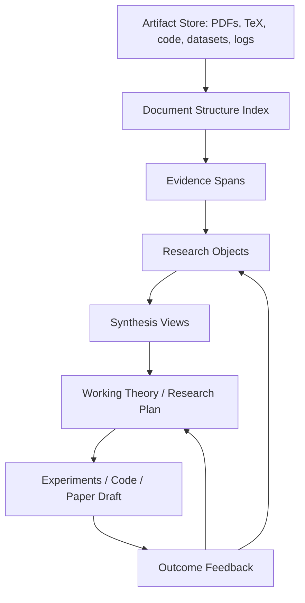

# Research Memory System: Memory For AI Scientists, Literature Review, And Research Engineering Agents

Status: concept/spec, not yet implemented.

Last updated: 2026-05-23.

## 1. Why Conversation Memory Is The Wrong North Star

LoCoMo, LongMemEval, and personal-chat recall benchmarks are useful because they are available, labeled, and force long-horizon retrieval. But they mostly test:

```text
Can the system remember conversational facts?
```

That is not the same as:

```text
Can an agent compound knowledge across hundreds of papers,
repos, experiments, negative results, and hypotheses to do novel research?
```

For an AI research agent, the important memory is not "Caroline wants to adopt." It is:

- Which assumptions a paper depends on.
- Which result is actually supported by which experiment.
- Which method failed and why.
- Which benchmark setting makes two papers incomparable.
- Which implementation detail is load-bearing.
- Which open problem remains after reading the field.
- Which hypothesis became less plausible after a failed run.
- Which combination of ideas is novel, feasible, and testable.

The right question is not "what facts should we write?" It is:

```text
What persistent research state lets an agent build better theories,
experiments, software, and papers than a raw-RAG/deep-research agent?
```

## 2. First-Principles Task Definition

A long-running research agent receives an unbounded stream:

```text
papers, PDFs, abstracts, blog posts, code repos, issues, datasets,
experiment logs, benchmark tables, meeting notes, failed ideas, user feedback
```

It must produce:

```text
novel hypotheses, literature reviews, experiment plans, code implementations,
benchmark comparisons, paper drafts, and strategic research decisions
```

The memory objective:

```text
maximize   research progress per unit time/context/compute
minimize   repeated reading, false novelty, unsupported claims, stale assumptions,
           duplicated experiments, and dead-end exploration
```

The core evaluation should measure research utility, not recall.

Primary metrics:

- `claim_grounding`: every generated claim is traceable to paper/code/data evidence.
- `coverage`: system found the important papers/methods/baselines for a question.
- `synthesis_quality`: system explains relationships, tradeoffs, contradictions, and gaps.
- `novelty_detection`: system can say whether an idea is actually new relative to prior work.
- `experiment_relevance`: proposed experiments test the crux rather than cosmetic ablations.
- `implementation_transfer`: system can turn paper/repo knowledge into working code.
- `negative-result_retention`: system does not retry known failed paths without a reason.
- `time_to_frontier`: how quickly a new agent reaches a useful frontier model of the field.
- `research_pareto`: quality vs paper tokens read, retrieved tokens, tool calls, and wall time.

## 3. Lessons From Current Systems

### Kosmos

Kosmos is the clearest signal that "memory for science" is not simple RAG. The paper describes an AI scientist that runs up to 12 hours across cycles of literature search, data analysis, and hypothesis generation. Its key architectural move is a structured world model shared between a literature-search agent and a data-analysis agent. Reported scale: over 200 agent rollouts, about 42,000 lines of code executed, and 1,500 papers read per run, with all report statements cited to code or primary literature.

What to steal:

- Shared world model across specialized agents.
- Literature and data analysis feeding the same persistent state.
- Every report claim backed by code or primary literature.
- Long multi-cycle runs where value scales with cycles.

What not to blindly copy:

- "Structured world model" is a broad phrase; the value likely comes from disciplined state updates and evidence auditability, not graph aesthetics.
- Verification remains the bottleneck; 79.4% statement accuracy means the system is useful but still dangerous without null models and human/automated audits.

### AI Scientist / AI Scientist v2

AI Scientist systems show end-to-end research loops: idea generation, coding, experiments, paper writing, and review. AI Scientist v2 moves toward agentic tree search and less reliance on human-authored templates.

What to steal:

- Research as search over ideas and experiments.
- Experiment manager as a first-class role.
- Paper-writing and review loops as evaluation artifacts.

What memory must add:

- Avoid repeating failed ideas across runs.
- Maintain a map from prior work to possible novel contributions.
- Track which generated ideas are actually supported by experiments.

### PaperBench

PaperBench is important because it evaluates whether agents can replicate real ICML papers from paper to code. It decomposes replication into thousands of gradable rubric items. The best reported agent score in the original release was 21.0%, so this is still hard.

What to steal:

- Rubric-decomposed evaluation.
- Paper-to-code replication as a realistic research-engineering benchmark.
- Memory should be judged by whether it improves rubric completion, not by whether it recalls trivia.

### PaperQA / PaperQA2

PaperQA-style systems show strong full-text scientific QA with citation grounding. PaperQA2/LitQA2 is a major baseline for literature search and synthesis.

What to steal:

- Full-text paper retrieval.
- Passage relevance assessment.
- Citation-grounded answers.

What memory must add:

- Persistent cross-paper synthesis, not one-off answering.
- Tracking contradictions, baselines, datasets, and methodological assumptions over time.

### SciAgents And Graph Reasoning

SciAgents uses graph reasoning and multi-agent roles to propose scientific hypotheses. This supports the idea that scientific discovery benefits from structured association across concepts.

What to steal:

- Associative search across distant literatures.
- Hypothesis generation from cross-field links.

What not to overclaim:

- A graph alone is not the invention. The hard part is deciding which nodes/edges matter and whether proposed links are true, useful, and testable.

### Repository Agents

For code, benchmarks like SWE-bench, RepoBench, and PaperBench expose the same memory problem in another domain:

```text
Can an agent understand a large artifact corpus well enough to make correct changes?
```

The repo analogue of a paper memory is:

- API contract.
- Architectural invariant.
- Call graph region.
- Test behavior.
- Known bug/failure.
- Extension point.
- Dependency/version constraint.
- Historical design decision.

This suggests the same system can serve both AI research and software architecture if the memory object is evidence-backed and task-oriented rather than chat-fact-oriented.

## 4. The Right Memory Unit: Research Objects, Not Facts

For research, the atomic memory unit should be a claim/evidence/action object.

Raw text chunk:

```text
Paragraph 4 of paper X says method Y improves F1 on dataset Z.
```

Weak memory:

```text
Paper X improves F1.
```

Useful research memory:

```json
{
  "object_id": "claim_abc",
  "object_type": "claim",
  "claim": "Method Y improves F1 over baseline B on dataset Z under setting S.",
  "support": [
    {
      "artifact_id": "paper_x",
      "locator": "section 4.2, table 3",
      "quote": "short extract or table cell",
      "confidence": "direct"
    }
  ],
  "conditions": [
    "dataset Z",
    "metric F1",
    "baseline B",
    "setting S",
    "model size 7B"
  ],
  "contrasts": [
    {
      "against": "claim_def",
      "relation": "incomparable",
      "reason": "different dataset split and judge"
    }
  ],
  "downstream_use": [
    "baseline selection",
    "related work",
    "experiment design"
  ],
  "status": "supported",
  "last_checked": "2026-05-23"
}
```

The point is not the enum. The point is that every memory object has:

- A proposition or reusable procedure.
- Evidence.
- Conditions of validity.
- Links to comparable/contradictory objects.
- A downstream use.
- A freshness/audit status.

## 5. Proposed Data Structure: Evidence-Backed Research Object Store

The scalable layout should be layered:



### Layer 0: Artifact Store

Immutable source artifacts:

- PDF.
- Parsed text.
- LaTeX/source if available.
- Tables/figures.
- Code repo snapshots.
- Dataset cards.
- Experiment logs.
- Web pages/blogs.

This is the equivalent of raw event log. Never delete it.

### Layer 1: Document Structure Index

For each paper:

- Title, authors, venue/date.
- Abstract.
- Section tree.
- Figure/table captions.
- References.
- Citation contexts.
- Methods/results/limitations sections.
- Equations and algorithms.
- Links to official code/data if present.

For each repo:

- File tree.
- README/API docs.
- Entry points.
- Tests.
- Dependency graph.
- Call graph summaries.
- Key config files.
- Example scripts.

This layer lets the agent navigate artifacts like a researcher, not like a bag of chunks.

### Layer 2: Evidence Spans

Evidence spans are citable excerpts or table cells.

Fields:

- `artifact_id`
- `locator`
- `text`
- `span_type`: method, result, limitation, baseline, dataset, implementation detail, negative result, definition
- `embedding`
- `hash`

Evidence spans are the bridge between raw documents and synthesized memory.

### Layer 3: Research Objects

These are compiled from evidence spans.

Core object families:

- `claim`: proposition supported by evidence.
- `method`: algorithm/procedure/architecture.
- `result`: metric under a specific setting.
- `baseline`: what must be compared against.
- `dataset`: data source and split/protocol.
- `metric`: what is measured and how.
- `implementation_detail`: code-level recipe that matters.
- `assumption`: condition a result depends on.
- `limitation`: known weakness.
- `negative_result`: tried path that failed.
- `open_question`: unresolved gap.
- `hypothesis`: possible new claim to test.
- `experiment`: proposed or executed test.
- `artifact_link`: relation to code/data/paper.

Again, these families are not a fixed final ontology. They are practical research roles. The model can generate new object types if useful, but these are the starting views needed for actual work.

### Layer 4: Synthesis Views

Synthesis views are generated indexes over research objects:

- Related-work matrix.
- Method taxonomy.
- Benchmark leaderboard with caveats.
- Contradiction map.
- Open-problem map.
- Novelty map.
- Implementation recipe map.
- Failure/negative-result log.
- Research plan DAG.

This is what an agent should read before doing new work.

### Layer 5: Working Theory

A working theory is the agent's current model of the field:

```json
{
  "research_question": "How should long-horizon agents consolidate memory?",
  "current_beliefs": [
    "Fixed ontologies help inspection but likely bottleneck scaling.",
    "Read-time recursive decompression is a strong baseline.",
    "Region-level consolidation is more scalable than per-op counterfactual reward."
  ],
  "cruxes": [
    "Does consolidated memory beat raw recursive reading at equal token/cost budget?",
    "Can future-query utility be predicted without expensive counterfactual evaluation?"
  ],
  "best_next_experiments": [
    "Pareto sweep over raw-RAG, RLM-reader, writer-only, consolidated memory.",
    "PaperBench-style rubric for memory-system implementation tasks."
  ],
  "known_dead_ends": [
    "Single-turn isolated write RL never learns updates/relations."
  ]
}
```

This is the thing conversation-memory systems usually lack. A scientist does not merely remember facts; they maintain an evolving theory of the problem.

## 6. Why A Plain Knowledge Graph Is Not Enough

A graph is a view, not the substrate.

Graphs are good for:

- Citation networks.
- Method-result-baseline relationships.
- Contradictions.
- Entity linking.
- Cross-paper association.

Graphs are bad as the only representation because:

- Papers contain long procedural details that do not compress into edges cleanly.
- The same result can be incomparable under different settings.
- Figures/tables/code evidence matter.
- Research objects need provenance and conditions, not just relation labels.
- Discovery requires open hypotheses and failed experiments, not only known facts.

The better substrate is a typed hypergraph over evidence-backed objects plus dense/lexical retrieval and synthesis views.

In plain terms:

```text
Keep raw artifacts.
Extract citable evidence spans.
Compile spans into reusable research objects.
Build graph/table/timeline views over those objects.
Keep an evolving working theory and experiment log.
```

## 7. How Full PDFs Should Be Processed

### Pass 1: Parse

Extract:

- Text by section.
- Tables as structured cells.
- Figure captions.
- References.
- Equations/algorithms if possible.
- Page/section locators.

Tools to consider:

- GROBID for scholarly metadata/sections/references.
- PyMuPDF or `pypdf` for simple PDF text.
- Nougat/marker-style pipelines for difficult PDFs if needed.
- ArXiv source TeX when available, often better than PDF text.

### Pass 2: Structural Summary

Create a paper card:

```json
{
  "paper_id": "arxiv:2511.02824",
  "title": "Kosmos: An AI Scientist for Autonomous Discovery",
  "one_sentence": "...",
  "problem": "...",
  "method": "...",
  "key_results": ["..."],
  "limitations": ["..."],
  "artifacts": ["code", "data", "supplement"],
  "why_it_matters_for_us": "..."
}
```

### Pass 3: Evidence Extraction

Extract candidate spans:

- Main claims.
- Tables/results.
- Dataset/protocol.
- Baselines.
- Limitations.
- Implementation details.
- Negative results.
- Future work.

Do not rely on one summary. Store the exact evidence.

### Pass 4: Cross-Paper Linking

Link:

- Same dataset/benchmark.
- Same method family.
- Same claim.
- Conflicting result.
- Improves/extends/refutes.
- Uses code/data from.
- Missing comparison.

### Pass 5: Synthesis Update

Update:

- Literature matrix.
- Novelty map.
- Open questions.
- Baseline checklist.
- Experiment plan.
- Working theory.

This is where the memory becomes useful. A PDF is not "read" until it changes the research state.

## 8. Reward / Eval For Research Memory

Conversation QA gives cheap labels, but the real evals should be task-oriented.

### Eval A: Literature Review Quality

Input:

```text
Research question + corpus of papers.
```

Output:

```text
Structured lit review with claims, comparisons, citations, gaps.
```

Score:

- Coverage of important papers.
- Correctness of claims.
- Citation support.
- Contradiction/gap identification.
- Usefulness to a researcher.

Baselines:

- Raw RAG over chunks.
- Deep Research style browsing.
- PaperQA/PaperQA2.
- Our research object store.

### Eval B: Novelty Check

Input:

```text
Proposed idea.
```

Output:

```text
Closest prior work, overlap, novelty delta, experiments needed.
```

Score:

- Finds nearest prior art.
- Correctly identifies what is not new.
- Finds a defensible novel angle if one exists.

### Eval C: Paper-To-Code / PaperBench-Style Replication

Input:

```text
Paper PDF and optional repo.
```

Output:

```text
Working implementation / experiment plan / replication report.
```

Score:

- Rubric completion.
- Tests pass.
- Reproduces key table/figure.
- Identifies missing details.

This is where memory over papers and repos becomes directly valuable.

### Eval D: Research Continuity

Input:

```text
Agent works on a research project over many days/runs.
```

Output:

```text
Next-day continuation that knows prior failed runs, current hypotheses, and best next experiments.
```

Score:

- Does not repeat failed work.
- Resumes from correct state.
- Updates beliefs after new evidence.
- Produces better next actions than raw log retrieval.

This connects back to the old elapsed-time/proactivity thesis, but in a stronger domain.

### Eval E: Repository Architecture Transfer

Input:

```text
Open-source repos relevant to a target product.
```

Output:

```text
Architecture recommendation and implementation plan for a new system.
```

Score:

- Correct API/library choices.
- Reuses proven design patterns.
- Avoids known pitfalls.
- Produces working code faster.

This is the software analogue of literature synthesis.

## 9. Product: Research OS / Corpus Compiler

The product is not another chatbot memory.

It is:

```text
An agent-readable research memory layer that compiles papers, repos, experiments,
and notes into a persistent, citable working model of a problem.
```

User-visible features:

- Import a paper corpus.
- Import code repos.
- Ask "what is the actual frontier?"
- Ask "is my idea novel?"
- Ask "what experiment would prove/disprove this?"
- Ask "which repo should I copy architecture from?"
- Ask "what did we already try and why did it fail?"
- Generate a related-work table with citations.
- Generate a benchmark/baseline checklist.
- Generate implementation plan linked to paper/repo evidence.

The wedge:

```text
Trustworthy deep research that compounds across sessions.
```

Current deep-research tools produce reports. This should produce a durable working model that improves every time it reads, codes, or experiments.

## 10. What To Build First

Do not start with RL.

Build a research-memory MVP:

1. Ingest 20-50 PDFs around one problem.
2. Parse into sectioned artifacts and evidence spans.
3. Generate paper cards.
4. Extract research objects with citations.
5. Build synthesis views:
   - method matrix
   - benchmark matrix
   - novelty map
   - open-problem list
   - implementation checklist
6. Run a lit-review/novelty-check eval against raw-RAG/PaperQA-style baseline.

The first demo should answer:

```text
"Here is my idea. What prior work kills it, what survives, and what experiment should I run next?"
```

The first paper artifact should be:

```text
Research Memory for AI Scientists: Evidence-Backed Working Models Beat Raw-RAG For Literature Synthesis And Research Continuity
```

## 11. How This Connects Back To Mempol

Old mempol:

```text
conversation -> memory writes -> future QA
```

Research mempol:

```text
papers/repos/experiments -> research objects -> working theory -> future research actions
```

The same abstract problem remains:

```text
What should an agent preserve from the past so future behavior improves under budget?
```

But the domain is better:

- Higher-value pain point.
- More natural multi-hop structure.
- Real need for provenance.
- Real need for negative results.
- Real need for temporal/project continuity.
- Clear product demo.
- Better alignment with AI-for-science and software-agent trends.

This also gives a better benchmark story:

- PaperQA/PaperQA2 for literature QA.
- PaperBench for paper-to-code replication.
- SWE-bench/RepoBench/FEA-Bench for repo understanding.
- Custom research-continuity eval for multi-day memory.

## 12. Core Bet

The core bet should be:

```text
The bottleneck for autonomous research is not just model intelligence or context length.
It is persistent, evidence-backed research state.
```

Long-context models can read more. Deep Research agents can browse more. But useful research requires knowing what has already been established, what remains uncertain, what failed, and what would move the frontier.

That is memory.

